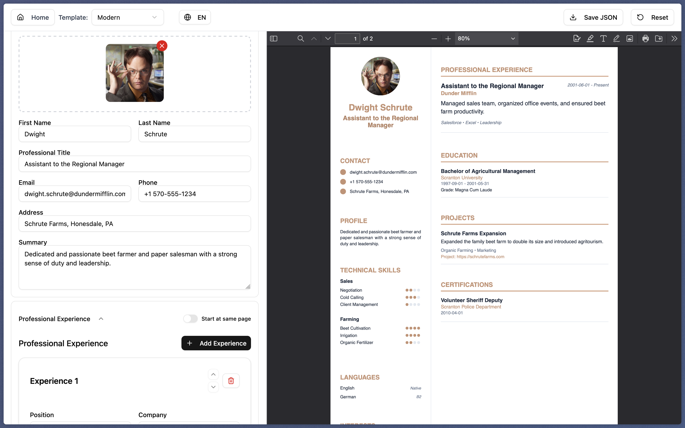

# Curry Culum

Easily create professional resumes with a modern and customizable interface.

Try it out at [https://curry-culum.manach.dev](https://curry-culum.manach.dev)

## Main Features

- Interactive editing of all CV sections (personal info, experience, education, skills, languages, projects, interests, certifications...)
- Multiple PDF templates (Simple, Modern, Selenium)
- Customizable colors, fonts, and section order
- Import/export your CV as JSON
- Automatic saving in your browser
- Supports both English and French

## Screenshots


> Simple template



> Modern template


> Selenium template

## Example JSON File

Transform your current CV to this JSON format using chatGPT or any other AI tool!


## Import/Export a CV

- **Export**: Use the "Export" button to download your CV as a JSON file.
- **Import**: On the home page, select a previously exported JSON file to resume editing.

## Quick Start

```bash
npm install
npm run dev
```

Open [http://localhost:5173/](http://localhost:5173/) in your browser.

## Customization

- Change colors, font, and section order in the editor.
- Choose a template: Simple, Modern, or Selenium.

## License

MIT

## Contributing

Contributions are welcome!

### Contribution Workflow

1. **Fork** this repository and create a branch for your changes.
2. **Clearly describe** your changes in the Pull Request (PR).
3. **Accepted contributions:**
   - Bug fixes
   - New CV templates
4. **To add a new template:**
   - Add your template component in `src/components/templates/`.
   - Register your template in `src/components/templates/index.ts` so it becomes available in the app.
   - By submitting a template, you agree it will be available to the whole community and distributed under the MIT license, like the rest of the project.
5. **Tests and documentation:**
   - If possible, add examples or update the documentation.

---

Open source project by [@baptiste-mnh](https://github.com/baptiste-mnh)

This project uses [shadcn/ui](https://ui.shadcn.com/) and [React 18+](https://react.dev/).\_
This project uses the [React-PDF](https://react-pdf.org/) library for PDF generation.

Thank you for helping improve this CV generator!
